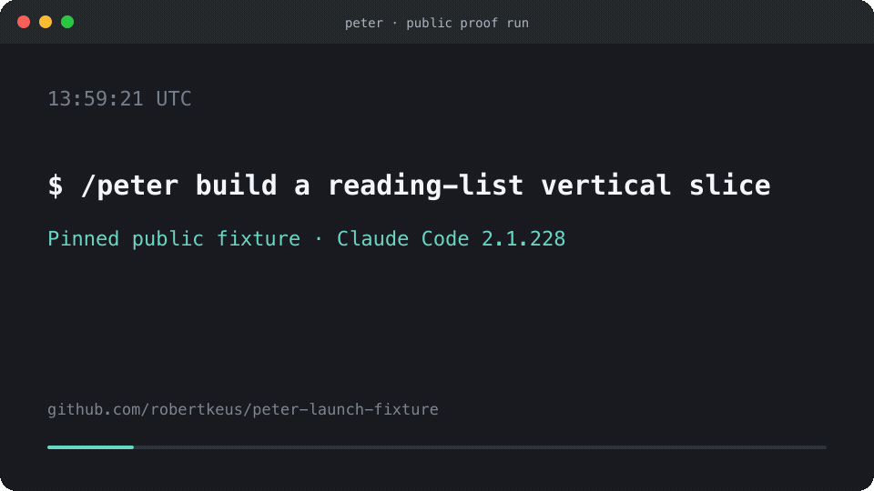

<p align="center">
  
</p>

<h1 align="center">Peter</h1>

<p align="center">
  <em>You describe it. He graphs it. He ships it.</em><br>
  <sub>Persistent work graphs and independently checked gates for Claude Code.</sub>
</p>

<p align="center">
  
  
  
</p>

<p align="center">
  <strong>One goal in &middot; one gated commit per task &middot; bounded autonomy</strong><br>
  <sub>Autonomous epic builds for Claude Code — graph engineering with the bars built in.
  Not a framework, not a runtime: a skill, four agent files, and a JSONL contract.
  The parent session is the runtime.</sub>
</p>

---

Peter is a Claude Code skill for work that is too large or failure-prone for one
prompt-and-hope loop. It decomposes a goal into a persistent dependency graph,
runs each task through project checks, and produces one traceable commit per
completed task. Repeated failures, missing credentials, and unresolved product
decisions return control to the operator instead of retrying forever.

## Public proof run



Peter built a complete reading-list vertical slice from one contract in a
[pinned public fixture](https://github.com/robertkeus/peter-launch-fixture/tree/ed3243ce70340eab73ed20d3956dde7efc14f64b):
3 planned tasks completed, 0 blocked, 4 audit findings filed as backlog, and 0
human interventions. Final gates were 33/33 unit/integration tests and 9/9 E2E;
the full-scope security and UI audits passed 8/10 and 9/10 after using their two
bounded repair loops. The run took 1:27:35 and Claude Code reported $27.63.

Read the [full reproducible run](docs/launch-run-template.md), inspect the
[baseline-to-result diff](https://github.com/robertkeus/peter-launch-fixture/compare/ed3243ce70340eab73ed20d3956dde7efc14f64b...9d01a0aba390948f9e99beaeeca961b5c0a29f73),
or open its [work graph and audit evidence](https://github.com/robertkeus/peter-launch-fixture/tree/9d01a0aba390948f9e99beaeeca961b5c0a29f73/runs/reading-list).

## How it works

No implementation code starts before its pass/fail bars exist:

```
1. Spec + pass/fail bars   → written first, or nothing gets built
2. Implement               → the minimum that meets the bars
3. Machine gates           → unit, typecheck, lint, build, e2e
                             (real server, real database — no mocks)
4. Conditional audit       → security for trust boundaries; UI for rendered work
5. Loop until green        → then exactly one commit
```

Small changes run that loop once and stop. Completed epics finish with the full
test suite and both read-only audit passes when their prerequisites are available.

Big goals become an **epic**: the goal is decomposed into a persistent work
graph (`runs/<epic-id>/graph.jsonl`, append-only) of dependency-ordered tasks,
then drained on a dedicated `epic/<id>` branch — one task at a time through the
gates above, one commit per task pushed as it lands (a dead machine costs at
most the task in flight), discovered work filed as new tasks instead of
scope-creeping the current one, until the epic closes or a stop condition hands
control back.

Implementation is zone-fenced across two builders. `backend-builder` owns
everything that doesn't render (API, CLI, library, pipeline, infra),
`frontend-builder` owns everything that does. The write fence is what makes a
parallel pair safe — a shared file has no fence, so co-located code goes to one
builder. The two auditors never write; they return verdicts.

## Honey + ESON

Two standards run through every agent in the graph:
[Honey](https://github.com/Green-PT/honey-for-devs) — write the minimum code
that needs to exist, say the minimum about it — and
[ESON](https://github.com/Green-PT/honey-eson), the wire format every subagent
return comes back in.

**Why it cuts tokens.** Output is the bill. Builders write only the code the
spec demands (stdlib before custom, nothing speculative) and skip the
narration; auditors return verdicts, not essays. Fewer tokens per unit of
shipped work — not fewer gates. An epic that runs tests, an OWASP pass and a
WCAG pass still costs more than a one-shot that skips them and ships a 500;
what's gone is the waste, not the rigor.

**Why runs have more context.** Every subagent return lands in the parent's
context window and stays there for the rest of the drain. A narrated diff
burns that window; an ESON manifest is a few lines. Less window spent per task
means more tasks fit before compaction — late tasks in a long epic still see
the spec, the graph, and every verdict that came before.

**Why agent-to-agent is more efficient.** The parent never parses prose — it
branches on fields:

```
!eson/1
status=green
files[2]{path,change}
src/checkout/api.ts	+stripe intent endpoint
src/checkout/api.test.ts	+4 cases
```

That's a whole task return. Cheaper than JSON on the wire — no braces or
quotes per row — and self-checking: `[2]` declares the row count, so a
truncated return is detected and re-requested instead of silently losing
findings. One carve-out is absolute: anything touching auth, money,
migrations, deletes, or data loss keeps its full text. Honey compresses
everything except the things that hurt when compressed.

ESON is the message format only — `graph.jsonl` stays JSONL.

## Install

Inspect the planned writes, then install:

```bash
git clone https://github.com/robertkeus/peter
cd peter
./install.sh --dry-run
./install.sh
```

The installer refuses to overwrite existing `skills/peter`, generated
`skills/build`, or Peter agent files. `./install.sh --force` preserves collisions
for restoration; `./install.sh uninstall` restores them. Forced replacement of
files changed after installation also writes a timestamped copy under
`~/.claude/peter-backups/`. Set `CLAUDE_CONFIG_DIR` to install somewhere other
than `~/.claude`; the legacy `CLAUDE_HOME` variable remains supported.

| Command | Effect |
|---------|--------|
| `./install.sh --dry-run` | Preview an install without writing files. |
| `./install.sh` | Install, or update an unchanged Peter installation. |
| `./install.sh --force` | Back up and replace reported collisions. |
| `./install.sh check` | Report drift between the repository and installation. |
| `./install.sh pull` | Copy installed Peter files back into the repository. |
| `./install.sh uninstall` | Remove Peter and restore pre-install files. |

## Commands

| Command | What it does |
|---------|--------------|
| `/peter <goal>` | Score the goal. Small → one enforced loop. Big → epic: work graph, dedicated branch, autonomous drain. |

## Layout

```
skills/peter/SKILL.md            the loop + epic orchestration
skills/peter/references/         work-graph, state, eson wire format, e2e/security/ui gate specs
agents/{backend,frontend}-builder.md   zone-fenced implementers
agents/{security,ui}-auditor.md        read-only verdict-only auditors
install.sh                       sync with ~/.claude
tests/install.sh                 installer integration coverage
```

## Requirements and limitations

- Claude Code 2.1.228 or newer with custom skills and subagents, plus Git,
  Node.js with `npx`, Chrome, and Bash 3.2 or newer. The installer targets macOS
  and Linux; native Windows is not tested.
- The builders select Sonnet and the auditors select Opus. Your Claude plan must
  provide those models. The UI auditor starts pinned Playwright MCP 0.0.79 with
  `npx`; its first run may download that package.
- Peter is prompt-level orchestration, not an operating-system sandbox. Run it
  only in repositories and environments you are willing to let Claude Code
  modify.
- Autonomy is bounded. Ambiguous requirements, unavailable services, missing
  credentials, operator-rejected dispatches, and repeated gate failures stop or
  block work for human review.
- Gates depend on the repository exposing runnable test, lint, build, E2E, and
  audit prerequisites. Missing prerequisites are reported, not counted as passes.
- Fewer handoff tokens do not guarantee a cheaper total run. Epics execute more
  checks than a one-shot coding prompt; publish costs with the workload and model.

## FAQ

**Why "peter"?**
Named for [Peter Steinberger](https://x.com/steipete), whose July 2026
question — "Are we still talking loops or did we shift to graphs yet?" —
sparked the graph-engineering framing this repo implements: a stable org graph
of specialist roles, a per-epic work graph of dependency-ordered tasks. No
affiliation or endorsement — just credit for the frame.

**Is it a framework?**
No. A skill, four agent files, and a JSONL contract. Claude Code is the
runtime; delete the files and it's gone.

**What if a task fails its gates?**
The failure is routed to the builder that owns it, with the actual error text.
It loops until green; a task that can't get there is filed as blocked and the
drain moves on. Stop conditions hand control back instead of burning tokens.

**Why are the subagent replies so terse?**
That's the house standard — see [Honey + ESON](#honey--eson).

**Can I use it with [ponytail](https://github.com/DietrichGebert/ponytail)?**
Different layers, same family: ponytail shrinks what one agent writes; peter
decides what gets built, in what order, and what "done" means. Peter's
builders already write minimal code — it's the house standard.

## License

[MIT](LICENSE). Use it, fork it, ship with it.

Contributions start with [CONTRIBUTING.md](CONTRIBUTING.md).
